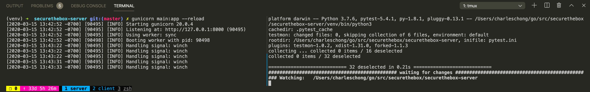

# securethebox
Master securethebox repo

# Getting Started
1. Clone this repo and initialize submodules
```
git clone https://github.com/cavalrytactics/securethebox.git
git submodule update --init --recursive
```
2. Install Docker-for-Mac
- make sure its running (It will be used to build images)

3. Install Server dependencies
```
cd securethebox-server
python3 -m virtualenv venv
. venv/bin/activate
pip3 install -r requirements.txt
```
- Now you need to have .env/secrets decrypted for local development

4. Install Client dependencies
```
cd securethebox-client
yarn install
```

# Terminal Setup
## Terminal 1 - Server

```
+──────────────────────────────────────+──────────────────────────────────────+
|                                      |                                      |
|      gunicorn main:app --reload      |  pytest -vs -x --testmon --loopfail  |
|                                      |                                      |
+──────────────────────────────────────+──────────────────────────────────────+
```
- gunicorn main:app --reload
- pytest -vs -x --testmon --loopfail

## Terminal 2 - Client

```
+──────────────────────────────────────+──────────────────────────────────────+
|                                      |                                      |
|              yarn start              |        yarn run relay --watch        |
|                                      |                                      |
+──────────────────────────────────────+──────────────────────────────────────+
```
- yarn start
- yarn run relay --watch

# About Backend
## Keeping it Simple
- flask, flask-restful, gunicorn, graphene
- pytest, pytest-testmon, pytest-xdist

# About Frontend
## Client Origin
- The origin/master is a private repo within ncmd account
- The ncmd/Fork is mirrored/duplicated into same account as public repo
  - This is done by entreee/git-sync-mirror
- The cavalrytactics organization forks the ncmd/Fork
```
[withinpixels/fuse-react] origin/master
├── [ncmd/fuse-react] fork/master
└── [ncmd/securethebox-client] mirror
    └── [cavalrytactics/securethebox-client] fork/skeleton
```

## Keeping Sync with origin/master
- Generate a Github Personal Access token for ncmd account
  - Github.com > Settings > Developer Settings > Personal access tokens
- Update USERNAME and REDACTED in this docker command
```
docker run --rm \
  --env SRC_REPO=https://github.com/ncmd/fuse-react.git \
  --env DST_REPO=https://github.com/ncmd/securethebox-client.git \
  --env SLEEP_TIME=3600s \
  --env SRC_REPO_TOKEN_USER=ncmd\
  --env DST_REPO_TOKEN_USER=ncmd\
  --env SRC_REPO_TOKEN=REDACTED \
  --env DST_REPO_TOKEN=REDACTED \
  enteee/git-sync-mirror
```
- Now on cavalrytactics/securethebox-client can compare forks
