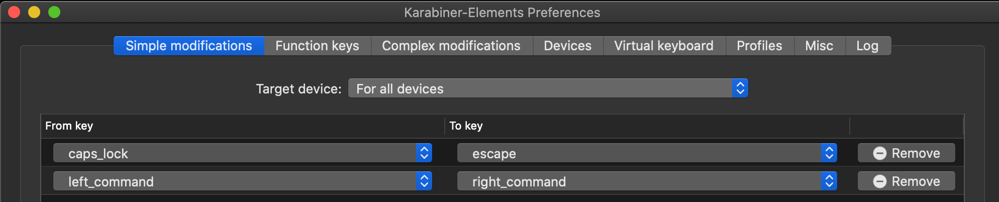
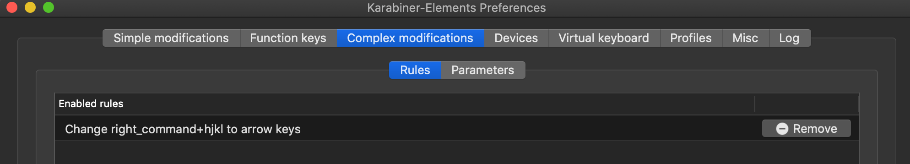
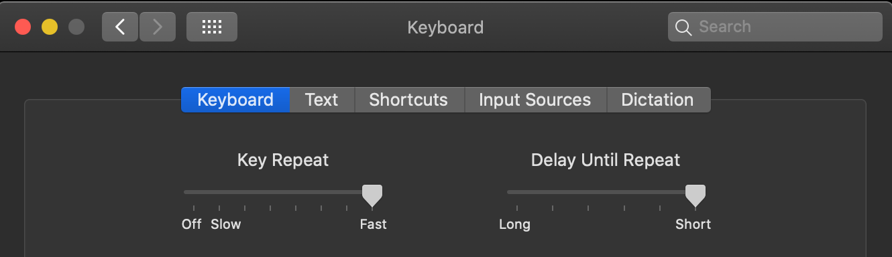
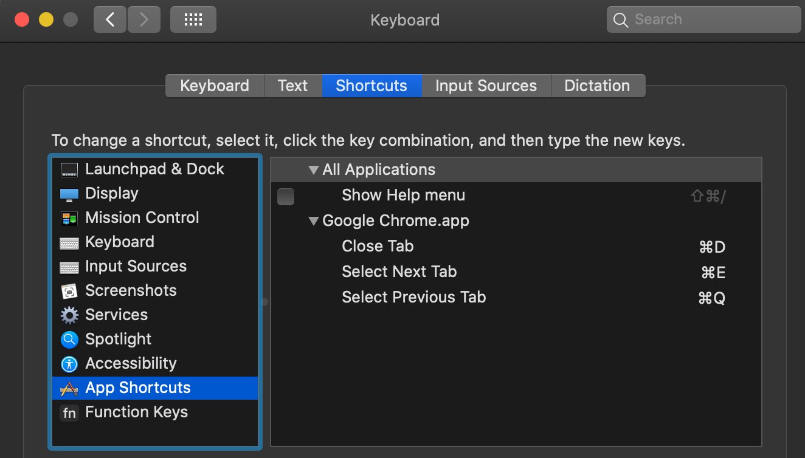
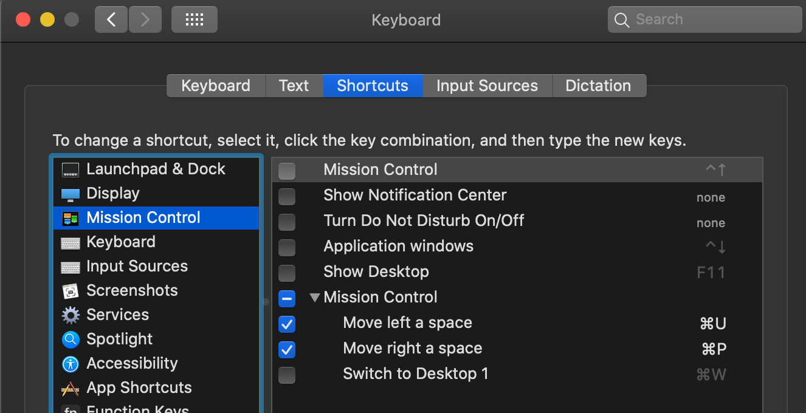

# Mac Setup
- https://karabiner-elements.pqrs.org
- Swap Esc with Caps Lock key
- Swap command_right with command_left


- Add complex rule to hjkl to directional


- Increase key speed


- Turn off press and hold 
```
defaults write NSGlobalDomain ApplePressAndHoldEnabled -bool false
```

## Mac App Shortcuts
- System Preferences > Keyboard > App Shortcuts
- Change Chrome shortcuts


## Mac Mission Control
- System Preferences > Keyboard > Mission Control


## Windows Manager 
```
brew install koekeishiya/formulae/yabai
brew services start yabai
```

## HotKeys Manager
```
brew install koekeishiya/formulae/skhd
brew services start skhd
```

## Terminal
- Alacritty
- https://github.com/alacritty/alacritty
```
brew cask install alacritty
```

## Multiplexer
- Tmux + Oh-my-zsh
```
+──────────────────────────────────────+──────────────────────────────────────+
ctrl + tab                             | toggle terminal
ctrl + `                               | select tab
shift + right-arrow                    | move to right tab
shift + left-arrow                     | move to left tab
ctrl + b > c                           | create new tab
ctrl + b > , > enter                   | rename tab
ctrl + b > x > y > enter               | close window
ctrl + b > 5                           | split window
+──────────────────────────────────────+──────────────────────────────────────+
```

# Editor VIM+VSCode   
- protip. replace esc with capslock
- practice touch-typing/motion everyday
- read: http://tnerual.eriogerg.free.fr/vimqrc.html daily

## Motion
- enable sneak plugin (within vscode vim settings) 
```
+──────────────────────────────────────+──────────────────────────────────────+
h                                      | left
l                                      | right
k                                      | up
j                                      | down
0                                      | move to start of selected line
$                                      | move to end of selected line
s > {char} > {char}                    | search for character
shift+s > {char} > {char} > ;          | search for character next
shift+s > {char} > {char}              | search backwards
shift+s > {char} > {char} > ;          | search backwards next
f > {char} > ,                         | move back to char
f > {char} > ;                         | move forward to char
shift + f > {char} > ;                 | move back to char
shift + h                              | move cursor to top of screen 
shift + m                              | move cursor to middle of screen 
shift + l                              | move cursor to bottom of screen 
g > i                                  | move to last edited section
g > g                                  | move first line
shift + g                              | move last line
{number} > shift + g                   | move to {num} line
shift + 5                              | move to matching {} or ()
+──────────────────────────────────────+──────────────────────────────────────+
```

## Normal mode
```
+──────────────────────────────────────+──────────────────────────────────────+
tab                                    | escape to enter NORMAL mode
cmd > click                            | multi cursor select
/ > {word} > enter                     | search for word FORWARD 
? > {word} > enter                     | search for word BACKWARD 
/ > {word} > enter > n                 | find next
q > :                                  | vim history 
+──────────────────────────────────────+──────────────────────────────────────+
```

## Insert and Replace
```
+──────────────────────────────────────+──────────────────────────────────────+
: > %s/old/new/g                       | replace string
x                                      | delete character in cursor position
shift + r                              | REPLACE mode
i                                      | INSERT mode inbetween
a                                      | INSERT mode append   
v                                      | VISUAL mode
shift + o                              | INSERT mode blank ABOVE selected line
o                                      | INSERT mode blank BELOW selected line
d > d                                  | delete line
c > c                                  | delete line and INSERT mode
shift + c                              | delete everything after cursor
shift + u                              | redo
u                                      | undo
d > l                                  | delete 1 character right
d > h                                  | delete 1 character left
d > a > w                              | delete selected word
cmd + k                                | move current line up
cmd + j                                | move current line down
y > y                                  | copy line
p > p                                  | paste line
g > u > a > w                          | convert word to lower case
g > shift+u > a > w                    | convert word to upper case
g > u > u                              | convert line all lower case
g > shift+u > shift+u                  | convert line all upper case
+──────────────────────────────────────+──────────────────────────────────────+
```

## Visual mode
```
+──────────────────────────────────────+──────────────────────────────────────+

v > highlight > o                      | swap highlight position
v > i > w                              | select word
v > i > w > shift + s                  | surround mode
v > i > w > shift + s > {char}         | surround with {char} 
v > i > w > y > esc > p                | copy word and paste after cursor
v > i > w > y > esc > P                | copy word and paste before cursor
+──────────────────────────────────────+──────────────────────────────────────+
```

# Editor control
## Quick search
```
+──────────────────────────────────────+──────────────────────────────────────+
space                                  | quick search                   *remap*
space > delete                         | search file                    *remap*
cmd + 1                                | find in files                  *remap*
cmd + 2                                | view explorer                  *remap*
cmd + 3                                | go to definition of cursor     *remap*
+──────────────────────────────────────+──────────────────────────────────────+
```

## Tab control
```
+──────────────────────────────────────+──────────────────────────────────────+
cmd + shift + t                        | re-open recently closed tab
cmd + d                                | close selected tab             *remap*
cmd + w                                | toggle to other split window   *remap*
cmd + e                                | toggle right tab               *remap*
cmd + q                                | toggle left tab                *remap*
+──────────────────────────────────────+──────────────────────────────────────+
```

## Window Splitting
```
+──────────────────────────────────────+──────────────────────────────────────+
cmd + m                                | split vertical                 *remap*
cmd + n                                | split horizontal               *remap*
+──────────────────────────────────────+──────────────────────────────────────+
```

# Chrome
```
+──────────────────────────────────────+──────────────────────────────────────+
ctrl + shift + t                       | re-open recently closed tab
cmd + e                                | toggle next tab                *remap*
cmd + q                                | close current tab              *remap*
cmd + d                                | open new tab                   *remap*
cmd + l                                | focus to search bar
space                                  | scroll down
shift + space                          | scroll up
+──────────────────────────────────────+──────────────────────────────────────+
```