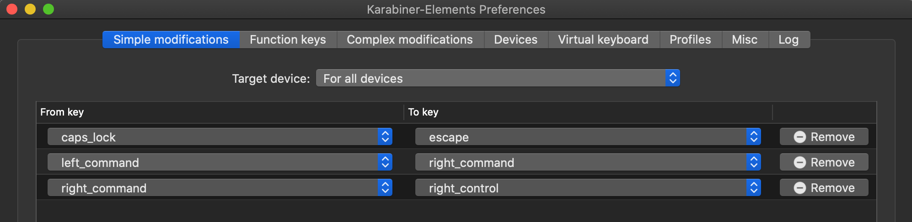

# Mac Setup
- https://karabiner-elements.pqrs.org
- Swap Esc with Caps Lock key
- Swap left_command with right_command
- Swap right_command with right_control


## Add complex modification rule to hjkl to directional

```
+──────────────────────────────────────+──────────────────────────────────────+
left_command + h                       | arrow left
left_command + j                       | arrow down
left_command + k                       | arrow up
left_command + l                       | arrow right
+──────────────────────────────────────+──────────────────────────────────────+
```
## Increase key speed


## Turn off press and hold 
```
defaults write NSGlobalDomain ApplePressAndHoldEnabled -bool false
```

## Mac App Shortcuts
- System Preferences > Keyboard > App Shortcuts
- Change Chrome shortcuts

## Mac Mission Control
- System Preferences > Keyboard > Mission Control

```
+──────────────────────────────────────+──────────────────────────────────────+
left_command + u                       | move window left
left_command + p                       | move window right
+──────────────────────────────────────+──────────────────────────────────────+
```
## Windows Manager 
```
brew install koekeishiya/formulae/yabai
brew services start yabai
```

## HotKeys Manager
```
brew install koekeishiya/formulae/skhd
brew services start skhd
```

## Terminal
- Alacritty
- https://github.com/alacritty/alacritty
```
brew cask install alacritty
```

## Multiplexer
- Tmux + Oh-my-zsh
```
+──────────────────────────────────────+──────────────────────────────────────+
right_command + tab                    | toggle terminal
left_command + w                       | select tab
shift + left_command > h               | move to left tmux tab
shift + left_command > l               | move to right tmux tab
right_command + a >                    | create new tab
right_command + a > , > enter          | rename tab
right_command + a > x > y > enter      | close window
right_command + a > 5                  | split window
right_command + a > h                  | move left split window
right_command + a > l                  | move right split window
right_command + r > {word}             | reverse search command history 
+──────────────────────────────────────+──────────────────────────────────────+
```

## Shell Alias
```
vim ~/.zshrc
alias g="git"
alias p="python3"
alias c="git add . && git commit -m 'quick deploy' && git push"
alias v=". venv/bin/activate"
source ~/.zshrc
```

# Editor VIM+VSCode   
- read: http://tnerual.eriogerg.free.fr/vimqrc.html daily

## Motion
- enable sneak plugin (within vscode vim settings) 
```
+──────────────────────────────────────+──────────────────────────────────────+
h                                      | left
l                                      | right
k                                      | up
j                                      | down
0                                      | move to start of selected line
$                                      | move to end of selected line
s > {char} > {char}                    | search for character
shift + s > {char} > {char} > ;        | search for character next
shift + s > {char} > {char}            | search backwards
shift + s > {char} > {char} > ;        | search backwards next
f > {char} > ,                         | move back to char
f > {char} > ;                         | move forward to char
shift + f > {char} > ;                 | move back to char
shift + h                              | move cursor to top of screen 
shift + m                              | move cursor to middle of screen 
shift + l                              | move cursor to bottom of screen 
g > i                                  | move to last edited section
g > g                                  | move first line
shift + g                              | move last line
{number} > shift + g                   | move to {num} line
shift + 5                              | move to matching {} or ()
+──────────────────────────────────────+──────────────────────────────────────+
```

## Normal mode
```
+──────────────────────────────────────+──────────────────────────────────────+
tab                                    | escape to enter NORMAL mode
left_command > click                   | multi cursor select
/ > {word} > enter                     | search for word FORWARD 
? > {word} > enter                     | search for word BACKWARD 
/ > {word} > enter > n                 | find next
q > :                                  | vim history 
+──────────────────────────────────────+──────────────────────────────────────+
```

## Insert and Replace
```
+──────────────────────────────────────+──────────────────────────────────────+
: > %s/old/new/g                       | replace string
x                                      | delete character in cursor position
shift + r                              | REPLACE mode
i                                      | INSERT mode inbetween
a                                      | INSERT mode append   
v                                      | VISUAL mode
shift + o                              | INSERT mode blank ABOVE selected line
o                                      | INSERT mode blank BELOW selected line
d > d                                  | delete line
c > c                                  | delete line and INSERT mode
shift + c                              | delete everything after cursor
shift + u                              | redo
u                                      | undo
d > l                                  | delete 1 character right
d > h                                  | delete 1 character left
d > a > w                              | delete selected word
left_command + k                       | move current line up
left_command + j                       | move current line down
y > y                                  | copy line
p                                      | paste line after cursor
shift + p                              | paste line before cursor
g > u > a > w                          | convert word to lower case
g > shift+u > a > w                    | convert word to upper case
g > u > u                              | convert line all lower case
g > shift+u > shift+u                  | convert line all upper case
+──────────────────────────────────────+──────────────────────────────────────+
```

## Visual mode
```
+──────────────────────────────────────+──────────────────────────────────────+

v > highlight > o                      | swap highlight position
v > i > w                              | select word
v > i > w > shift + s                  | surround mode
v > i > w > shift + s > {char}         | surround with {char} 
v > i > w > y > esc > p                | copy word and paste after cursor
v > i > w > y > esc > P                | copy word and paste before cursor
+──────────────────────────────────────+──────────────────────────────────────+
```

# Editor control
## Quick search
```
+──────────────────────────────────────+──────────────────────────────────────+
space                                  | quick search                   *remap*
space > delete                         | search file                    *remap*
left_command + 1                       | find in files                  *remap*
left_command + 2                       | view explorer                  *remap*
left_command + 3                       | go to definition of cursor     *remap*
+──────────────────────────────────────+──────────────────────────────────────+
```

## Tab control
```
+──────────────────────────────────────+──────────────────────────────────────+
left_command + shift + t               | re-open recently closed tab
left_command + d                       | close selected tab             *remap*
left_command + w                       | toggle to other split window   *remap*
left_command + e                       | toggle right tab               *remap*
left_command + q                       | toggle left tab                *remap*
+──────────────────────────────────────+──────────────────────────────────────+
```

## Window Splitting
```
+──────────────────────────────────────+──────────────────────────────────────+
left_command + m                       | split vertical                 *remap*
left_command + n                       | split horizontal               *remap*
+──────────────────────────────────────+──────────────────────────────────────+
```

# Chrome
```
+──────────────────────────────────────+──────────────────────────────────────+
ctrl + shift + t                       | re-open recently closed tab
left_command + e                       | toggle next tab                *remap*
left_command + q                       | close current tab              *remap*
left_command + d                       | open new tab                   *remap*
left_command + l                       | focus to search bar
space                                  | scroll down
shift + space                          | scroll up
+──────────────────────────────────────+──────────────────────────────────────+
```